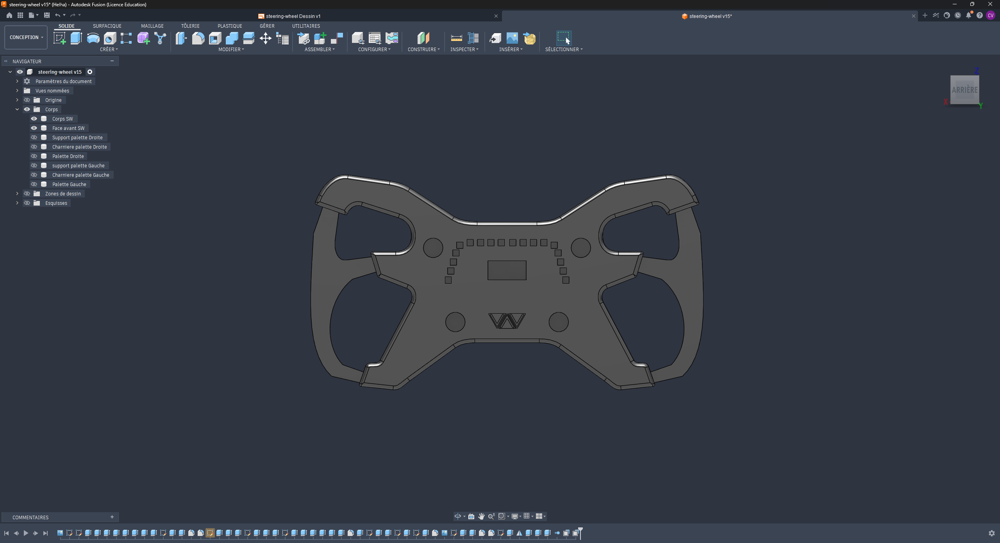
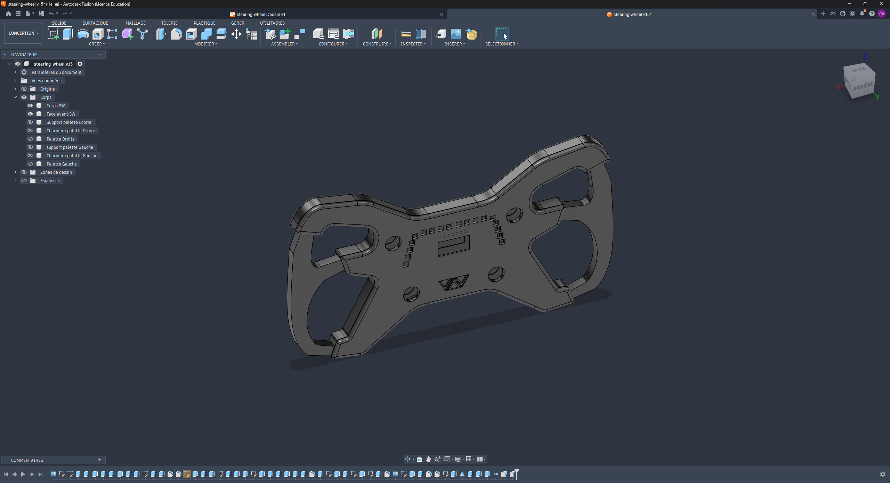
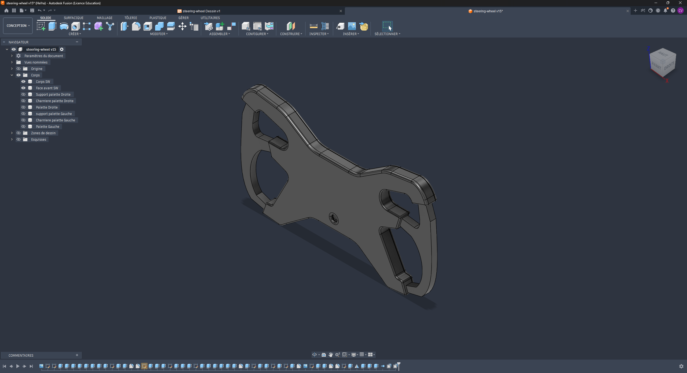
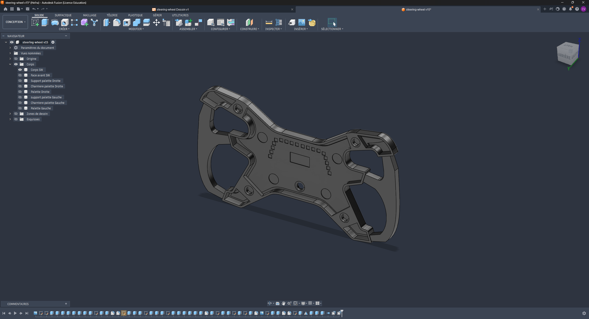
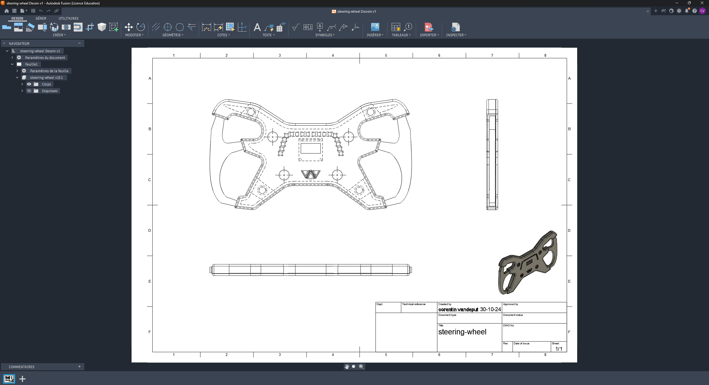
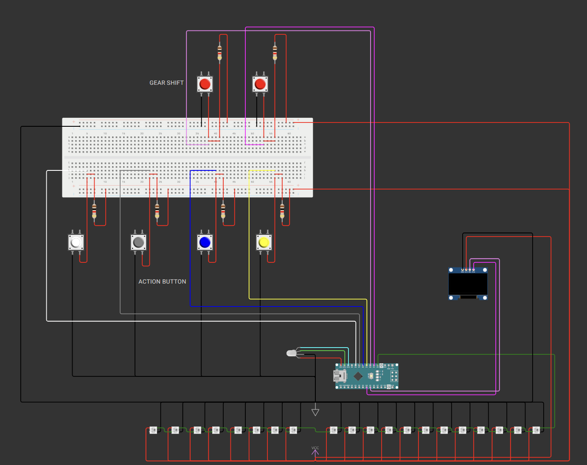

<div align="center">

# Sim Racing Wheel

**Volant de simulation type F1, conçu de zéro : modélisation 3D, PCB custom, firmware Arduino.**

Fusion 360 · PCB 2 couches · Arduino Nano · 18 LEDs RGB · écran OLED · palettes à charnière



</div>

> **🚧 Work in progress** — la mécanique et l'électronique sont finalisées. Le firmware gère l'OLED, les rapports, le chronomètre et le compte-tours ; il reste à le brancher sur une vraie source de télémétrie.

---

## Description

Volant de simulation automobile inspiré des monoplaces de F1, entièrement conçu et fabriqué maison. La coque est modélisée dans Fusion 360 et imprimée en 3D, l'électronique repose sur un PCB deux couches dessiné pour l'occasion, et l'ensemble se connecte en USB-C.

Le volant intègre une barre de 18 LEDs RGB adressables faisant office de compte-tours, un écran OLED central pour la télémétrie, deux encodeurs rotatifs, des boutons poussoirs, et deux palettes de changement de vitesse montées sur charnières.

## Conception 3D

Modélisé sous Fusion 360 en corps séparés : coque principale, face avant, supports de palettes, charnières et palettes gauche/droite.

| Vue de face | Vue trois-quarts |
|:---:|:---:|
|  |  |

**Face arrière** — nervures de rigidification, logements de vis et passages de câbles vers les palettes.

<div align="center">

</div>

**Dessin technique coté**

<div align="center">

</div>

---

## Électronique

PCB deux couches dessiné sous EasyEDA, fichiers Gerber et pick-and-place prêts pour la production.

| Réf. | Qté | Composant | Rôle |
|---|:---:|---|---|
| U1 | 1 | Arduino Nano | Contrôleur, interface USB HID |
| LED1-18 | 18 | WS2812B-V5/W | Barre de compte-tours RGB adressable |
| OLED1 | 1 | HS13L03W2C01 | Affichage télémétrie |
| SW1-2 | 2 | ALPS EC11E09244BS | Encodeurs rotatifs cliquables |
| SWITCH1-2 | 2 | K6-6275D03 | Boutons poussoirs |
| USBC1 | 1 | MC-311D | Connecteur USB-C |
| C1-18 | 18 | 100 nF | Découplage, un par LED |
| R1 | 1 | 470 Ω | Résistance de ligne de données WS2812B |
| R2-5 | 4 | 220 Ω | Limitation de courant |

Nomenclature complète, empreintes et références LCSC dans `PCB/BOM_Board1_PCB1_2024-10-15.xlsx`.

Le découplage à 100 nF par LED et la résistance série de 470 Ω sur la ligne de données suivent les recommandations du fabricant WS2812B — sans elles, une chaîne de 18 LEDs devient instable.

---

## Firmware

Arduino Nano, OLED SSD1306 en I2C, six boutons en `INPUT_PULLUP`, barre de LEDs adressables et potentiomètre simulant le capteur de régime. Le projet est développé et simulable sous Wokwi : [wokwi.com/projects/400891434411566081](https://wokwi.com/projects/400891434411566081).

<div align="center">

</div>

### Affectation des broches

| Broche | Signal | Rôle |
|:---:|---|---|
| D2 | `led` (NeoPixel) | Ligne de données de la barre WS2812B |
| D3 | `BP_DWS` | Palette gauche — rétrograder |
| D4 | `BP_UPS` | Palette droite — monter un rapport |
| D5 | `BP_GE` | Affiche le rapport engagé |
| D6 | `BP_CHR_RST` | Remise à zéro du chronomètre |
| D7 | `BP_CHR` | Chronomètre — start / pause / reprise |
| D8 | `BP_RPM` | Affiche le régime moteur |
| A3 | `potentiometre` | Capteur de régime (potentiomètre en simulation) |
| A4 / A5 | `SDA` / `SCL` | Bus I2C de l'OLED (adresse `0x3C`) |

### Fonctionnement

**Rapports** — les palettes incrémentent et décrémentent `Gear_Engaged` de N à 5. L'écran ne se rafraîchit que si le rapport a changé, via `previousGearDisplayed`, pour éviter de redessiner l'OLED à chaque tour de boucle.

**Compte-tours** — la lecture analogique 0-1023 est découpée en vingt paliers qui remplissent progressivement la barre : vert jusqu'à neuf LEDs, puis rouge, puis magenta sur les cinq dernières. C'est la logique classique d'un shift light de F1 : le pilote change de rapport quand la zone magenta s'allume.

**Chronomètre** — machine à trois états (`stop` / `run` / `pause`) avec détection de relâchement du bouton, plus un bouton de reset dédié.

**Écran** — l'affichage courant est mémorisé dans `AFF`, ce qui permet de savoir quelle vue redessiner après un changement d'état.

### Dépendances

`Adafruit GFX`, `Adafruit SSD1306` et `Adafruit NeoPixel` — voir `Programmation/libraries.txt`.

### Points à corriger

- La barre est déclarée à **21 LEDs** dans le firmware alors que le PCB en compte **18**. Les indices 16 à 20 de la zone magenta pointent hors de la chaîne physique.
- L'écran RPM affiche la chaîne littérale `"valeur-RPM"` au lieu de `pot_cap_RPM`.
- Les vingt `if` en cascade du compte-tours sont indépendants et tous évalués à chaque tour ; une boucle avec un seuil calculé ferait la même chose en cinq lignes.
- `MonEcran.setCursor(1000, 1000)` au démarrage place le texte d'initialisation hors de l'écran.
- Les `delay(200)` et `delay(1000)` bloquent la lecture des boutons pendant l'antirebond.

---

## Structure du projet

```
├── 3D/
│   ├── steering-wheel v12.stl / .3mf   # Modèle courant
│   ├── Plan steerign wheel.pdf         # Plan coté
│   └── Previous/                       # Itérations v11 à v13
├── PCB/
│   ├── Gerber_PCB1_2024-10-15.zip      # Fichiers de fabrication
│   ├── BOM_Board1_PCB1_2024-10-15.xlsx # Nomenclature
│   ├── PickAndPlace_PCB1_2024-10-15.*  # Placement composants
│   ├── PCB-steeringWheel.epro          # Projet EasyEDA
│   └── contour-volant.dxf              # Contour du PCB
├── Programmation/
│   ├── sketch.ino                      # Firmware Arduino
│   ├── diagram.json                    # Schéma de câblage Wokwi
│   ├── wokwi-schema.png                # Rendu du schéma
│   ├── libraries.txt                   # Bibliothèques requises
│   ├── logo-binaire.txt                # Bitmap du logo pour l'OLED
│   └── g1177.png                       # Source du logo
└── Picture/                            # Rendus et dessins techniques
```

## Fabrication

**Impression 3D** — imprimer `3D/steering-wheel v12.3mf`. PLA ou PETG, couches de 0.2 mm, remplissage 25 % minimum sur la coque qui encaisse les efforts de direction, supports nécessaires sur les logements de palettes.

**PCB** — envoyer `PCB/Gerber_PCB1_2024-10-15.zip` à un fabricant (JLCPCB, PCBWay). Pour l'assemblage automatisé, joindre le BOM et le fichier pick-and-place, les références LCSC y sont déjà renseignées.

**Firmware** — ouvrir `Programmation/sketch.ino` dans l'IDE Arduino, ou importer `diagram.json` et `sketch.ino` sur Wokwi pour simuler sans matériel.

## Reste à faire

- [x] Publier le firmware Arduino et le schéma Wokwi
- [x] Documenter le mapping des broches
- [x] Piloter la barre WS2812B (compte-tours)
- [ ] Aligner le nombre de LEDs du firmware (21) sur celui du PCB (18)
- [ ] Afficher la vraie valeur de régime sur l'OLED
- [ ] Remplacer la cascade de vingt `if` par une boucle
- [ ] Remplacer les `delay()` par un antirebond non bloquant
- [ ] Remplacer le potentiomètre par une vraie source de télémétrie
- [ ] Photos du volant assemblé
- [ ] Câblage des palettes et choix des switches
- [ ] Support de fixation sur base de force feedback

---

<div align="center">

**Vandeput Corentin** · [devworks.be](https://devworks.be)

</div>
